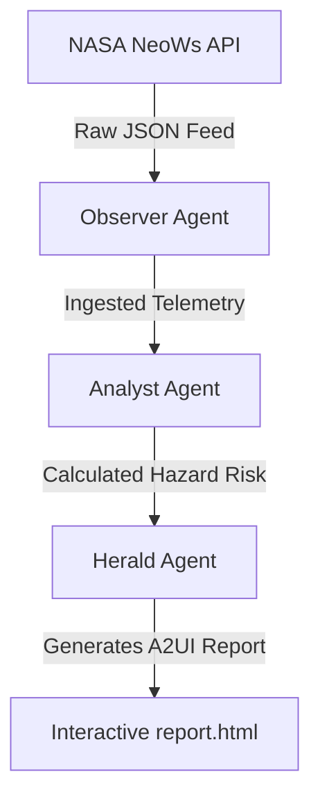

# 🛡️ Orbital Shield: Planetary Defense Multi-Agent Threat Network

Orbital Shield is a fully autonomous multi-agent system designed to fetch real-time near-Earth asteroid telemetry from NASA's NeoWs API, calculate impact risk scores, and generate an immersive, retro-futuristic tactical space monitoring dashboard. 

Developed as part of the **Kaggle 5-Day AI Agents: Intensive Vibe Coding Capstone Project**, this project demonstrates how collaborative agentic systems can translate complex, raw astronomical data feeds into intuitive and engaging real-time visualizations.

---

## 🌌 Interactive Demo Preview
When generated, the interactive dashboard (`report.html`) renders a full-screen, high-performance HTML5 Canvas simulation of the Solar System:
- **Complete 8-Planet Simulation:** Sun, Mercury, Venus, Earth, Mars, Jupiter, Saturn, Uranus, and Neptune orbit dynamically.
- **Dynamic Asteroid Vectors:** Near-Earth objects are mapped around Earth, with coordinates and orbits relative to Earth's position.
- **Lock-On Tracking Laser:** Clicking or hovering over any asteroid sweeps a target laser from Earth, acquiring lock-on target metrics in the HUD.
- **Synthesized Audio SFX:** Real-time retro synth sweep sounds, lock-on confirmation tones, and warning alarms are programmatically synthesized directly via the Web Audio API.
- **Agent Operations Log Terminal:** An on-screen collapsible typewriter terminal details the live step-by-step actions, URL validations, and security checks executed by the background Python agents.

---

## 🛠️ Multi-Agent Architecture
The orchestrator drives a modular pipeline consisting of three specialized agents collaborating sequentially:



1. **Observer Agent (`ObserverAgent`):** Fetches Near-Earth Object data. Features API validation guardrails and an automatic mock data fallback system if rate-limits are exceeded.
2. **Analyst Agent (`AnalystAgent`):** Feeds asteroid diameters, relative velocities, and close-approach distances into threat analysis formulas.
3. **Herald Agent (`HeraldAgent`):** Assembles and builds the interactive HTML/JS tactical dashboard containing compiled asteroid metrics.

---

## 🎓 Capstone Key Concepts Demonstrated

| Course Key Concept | Code Implementation in Orbital Shield |
| :--- | :--- |
| **Agent / Multi-Agent System (ADK)** | Orchestrated via `main.py` where `ObserverAgent`, `AnalystAgent`, and `HeraldAgent` run in sequence. |
| **MCP Tools** | Ingested through modular functions in `mcp_tools/nasa_api.py` and `mcp_tools/hazard_calculator.py`. |
| **Agent Skills** | Driven by guidelines in `skills/hazard_analyzer/skill.md` defining step-by-step analysis logic. |
| **Security Features** | Implemented as: <br>1. **URL Validation Guardrail:** Ensures API calls only point to `api.nasa.gov`. <br>2. **Write Restrict Guardrail:** Prevents file writes outside the local workspace `/output/` folder path. <br>3. **API Rate Limiting Resiliency:** Gracefully falls back to mock telemetry under HTTP 429 rate limits, preventing system crashes. |

---

## 📂 Project Structure
```
orbital-shield/
│
├── orchestrator/
│   └── main.py              # Main orchestrator pipeline & HTML dashboard templates
│
├── mcp_tools/
│   ├── nasa_api.py          # NASA NeoWs API client tool
│   └── hazard_calculator.py # Threat assessment calculation engine
│
├── skills/
│   └── hazard_analyzer/
│       └── skill.md         # Threat analysis skill definition
│
├── agents.md                # Flow descriptions and agents metadata
├── agent.yaml               # Workspace configuration
└── README.md                # Project documentation
```

---

## 🚀 Setup & Execution

### Prerequisites
Make sure Python 3.8+ is installed on your system.

### 1. Clone the Repository
```bash
git clone https://github.com/your-username/orbital-shield.git
cd orbital-shield
```

### 2. Install Dependencies
Install the required HTTP request client:
```bash
pip install requests
```

### 3. Run the Orchestrator
Execute the pipeline. On Windows systems, enable UTF-8 encoding support to display logs correctly:
```bash
# Windows Powershell
$env:PYTHONIOENCODING="utf-8"; python orchestrator/main.py

# macOS / Linux Terminal
python orchestrator/main.py
```

### 4. Open the Dashboard
Once execution finishes, open the newly generated **`report.html`** file in any modern web browser to view the interactive space monitor.
